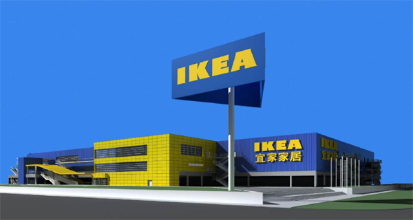
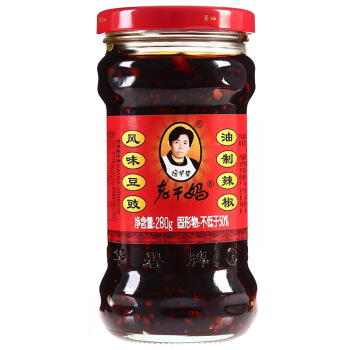
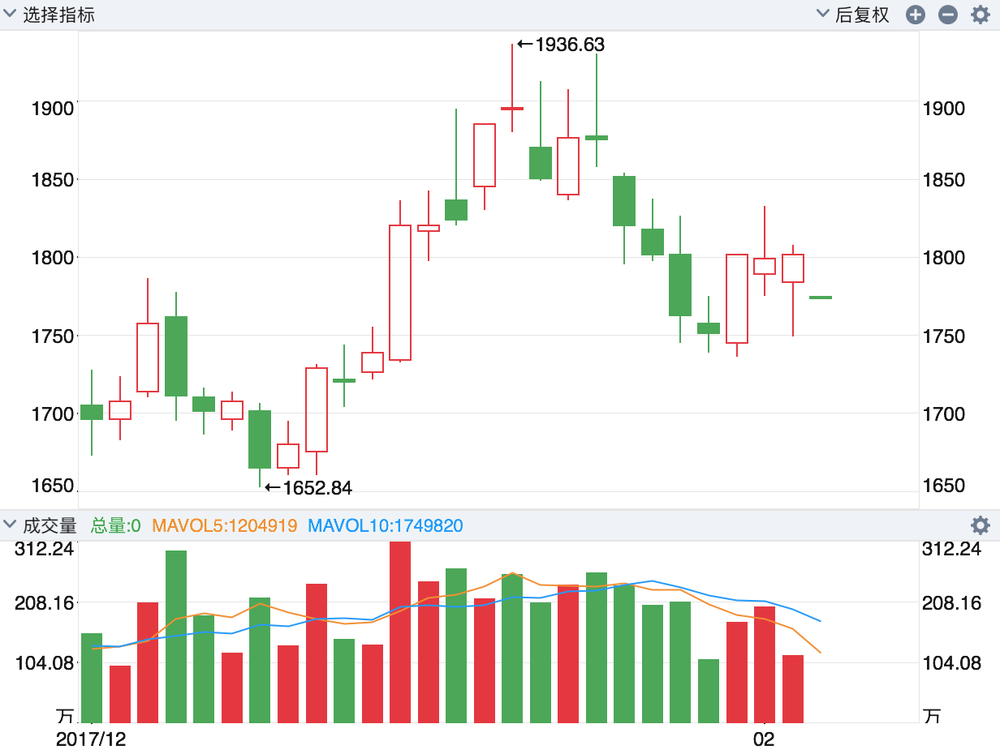
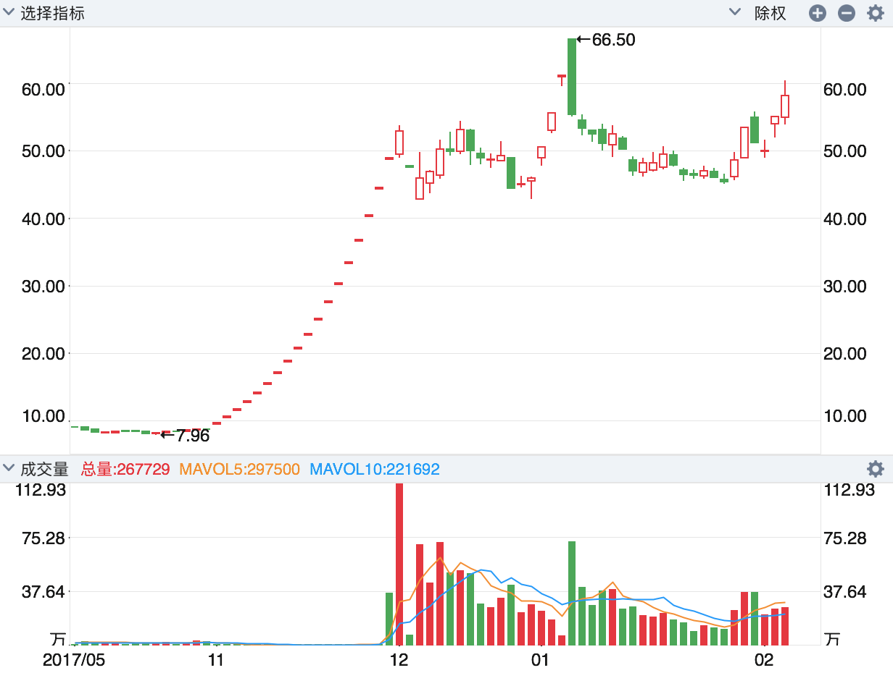

## 第一讲：投资与股票交易的规则

### 目录

这一部分我们先聊一下大佬们的投资市场（一级市场）和散户/技术宅/宽客们也可以玩的投资市场（二级市场），然后我们介绍一些做量化交易必须了解的股票交易规则。在说这个部分的正题之前，我们有必要再说一下**投资**。投资就是花钱买资产，期望能够带来收益，投资所买的资产也称为**投资标的**。投资标的有很多类型，包括一家公司的所有权或者股份、上市公司的股权、期货、期权、基金等。我们最常说的炒股就是在投资上市公司的股权。

* 一级市场与二级市场
* 股票是如何交易的？
* 如何看懂行情软件显示的数据？
* 交易所规则：涨跌幅限制
* 交易所规则：停复牌
* 交易所规则：除息除权

### 一级市场

拿投资公司的股份来说，假设你要投资的公司是未上市的公司，比如现在的ofo、今日头条等。对这些公司进行投资，即出钱认购这些公司的一部分股份，公司盈利之后，股票的价值增加，就能够通过出售相应的股份来获得收益。

但是通常来讲，我们用多少钱能换到公司的多少股份其实很难确定，这就涉及到需要对公司进行**估值**。比如你现在想投资一百万，如果某个公司估值是一千万，那么你就能用着一百万来获得该公司10%的股份。如果你要投资的这家公司是江南皮革厂，它的主要价值在于它拥有的库存的产品、生产的机器和厂房等，通常这一类工厂的估值就比较容易，我们只需要把相应的皮包、生产线按照相应的价值折算成人民币就可以了，这样估算出来的价值一般比较准确。但是现在很多企业的价值并不仅仅在于这些可以计算清楚的资产，比如ofo的估值就不仅仅在于它拥有的小黄车的价值，而更多的在于它的品牌和商业模式。因此，对于不同的投资人来讲，对于未上市公司的估值差异一般是比较大的。

这一部分的投资通常由一些机构来完成，主要有如下几个原因。其一，需要的资金量比较大，一般都是几百万到几十亿地投，一般人也没这个钱；其二，其风险是很高，这些被投资的公式大多数都没有办法等到上市或者盈利的那一天，一般来讲，投十个成功一个已经很不错了；其三，需要相关领域及其专业的只是，这些等待投资的公司业务水平参差不齐，但是忽悠水平基本上都是一流的，如果没有一定的专业知识很容易被这些公司忽悠地团团转。当然也有一些个人来做，就是我们说的天使投资人什么的，他们凭借自己对于某些行业的专业知识，来准确对公司进行估值和投资，以获得收益。

这些投资即我们常听到的VC（Venture Capital，风险投资）、PE（Private Equity，私募股票投资）等，属于**一级市场**。一级市场相对来讲属于比较“脏”的劳动，需要对于相应的行业有很深的理解、需要对于特定的公司进行详细的调研、甚至需要对于该公司的创始人都要能有足够的观察，这部分的投资不是我们前面讲到的适合理工科宅男/宅女的工作。当然，这部分工作如果能够做的好，回报也是相当丰厚的。一般对于某个公司的投资目标都是冲着翻几十倍甚至几百倍去的。

### 二级市场

通常来说，当一家公司发展壮大之后，就会进行**IPO**（Initial Public Offering，首次公开发行），就是能够通过增发股份公开地募集资金了。一般来讲，IPO之后公司就会在交易所挂牌交易，这就是我们常说的**上市**。公司上市之后，普通的股民就可以自由买卖该公司的股票了。公司的股份在交易所交易的时候已经被拆成了上千万股，因此股民花个几千或者几万块钱就可以买入公司的一手（=100股）股份，这样也大大降低了公众投资的资金门槛。另外，所有在交易所挂牌交易的股票都遵循同一套交易规则，并且需要符合交易所的同一套规定，比如定期财务审计和公告、重大事项披露等，这个给我们做量化带来了很多便利。股民在交易所自由买卖某公司的股票的市场，我们一般就把它叫做**二级市场**。一般来说，公司上市之后VC和PE投资人就算是快成功完成这一场投资了，在公司上市之后（还需要在禁售期之后），这些资金一般就会选择退出，相应的股份就会由股民来接盘。

大家通常觉得一家公司上市了就很牛逼，其实并不是这样。上市是因为公司需要融资，要么是因为需要更多的钱来扩大再生产，而自己又找不到这么多钱；要么是因为在早些时候拿了投资人的钱，就得照顾投资人的利益，通过上市来让投资人把他们所取得的收益兑现。所以上市说明公司缺钱，其目的主要就是向股民借钱。并不是所有的公司做大了都会上市，比如瑞典的宜家就是属于传统的家族企业的模式，其掌门人也宣称宜家永远不上市。其主要原因就是1）上市之后会丧失对企业的掌控能力，毕竟拿了金主爸爸的钱就要听金主爸爸的话；2）上市就必须要进行交易所规定的信息披露，这会影响公司的避税；3）当然最主要的原因就是人家不缺钱或者有其他的融资方式。公司通过上市的方式来融资主要目的就是分担风险，因为如果公司亏损股民也需要承担一部分损失，相应的补偿就是如果公司盈利也需要给股民一部分收益。如果一家公司一直都稳定赚钱，那么公司显然就不需要来找公众来分担风险，如果公司缺钱也会去找银行贷款或者发行债券，这样需要支付的利息是恒定的，但是比分给股民的收益小很多，公司经营的风险就由公司自己来承担。同样的例子还有“国民女神”陶碧华所经营的老干妈，即使年销售额达到几十亿，足够上市公司的规模了，但是人家就是不上市。陶碧华本人称“上市就是欺骗人家的钱”。

图：宜家家居



图：老干妈陶碧华



讲了这么多，看起来公司上市之后股民来投资好像真的是凶多吉少。但其实为了保证股民们的利益，交易所制定了许多的规则，来确保这些上市公司不坑股民。首先，公司要上市就需要满足诸多的规定，其中包括公司要成立多少年以上，并且近几年都要有足够的利润等。同时，上市之后也需要及时披露公司的各种规定的信息，比如公司每季度的营业状况、高管的变动、高管的薪资等。如果公司上市之后营运出现问题，交易所也会对相关的公司做出警告甚至强制其退市。总的来说，以近两年的股市为例，按上证综指来算的话，年化收益率也是也是远超过定期存款的。因此，如果采取有效的投资方法，在股市中也是能取得较好的收益的。

总结一下，**一级市场**指的是从天使投资人开始给公司投资到公司上市这段时期的资本市场，这段时期是公司成长最快、盈利最多的一段时期，同时也是风险最高的一段时期，它需要投资人较多的专业知识和较高的资金门槛。**二级市场**指的是公司上市之后股民开始可以在交易所买卖相应股票的市场，它相比于一级市场来说风险更小、收益也更小，不过其收益和风险相比于余额宝或者定期存款也是十分巨大的了。

### 股票是如何交易的？

股票交易本质上和日常去菜市场买菜差不多。卖家说一颗白菜一块钱，买家觉得这个价格可以接受就可以付钱取走菜。股票交易就是把这白菜、莴笋换成了平安银行股票、万科的股票等等，交易场地由菜市场换成了股票交易所。我们国家的股票交易所主要就是**深圳证券交易所**和**上海证券交易所**。股票交易和菜市场买菜不一样的地方主要在于，在菜市场中你不仅关心白菜的价格，同时还关心白菜的质量，有时候我们还会觉得图便宜买了的白菜可能不好吃。在股票交易中，A卖的白菜和B卖的白菜，只要它们都是白菜就没有任何区别，买到一棵白菜的价格越便宜越好。因此对于买家来说，目标就是以最低的价格买到白菜；而对于卖家来说就最高的价格卖出白菜。市场上可能有几千个人都要卖白菜，同时由由几千个人想买白菜，那么如何决定把谁的白菜卖给谁呢。于是交易所使用了我们称之为**竞价交易**的方式来进行交易的撮合。

在炒股软件上（通常在软件的右上方）我们可以看到这样的信息，它是**限价委托薄**（limit order book）/订单薄的一个表示，股民们一般称之为**盘口**。

```
卖五      20.00       3
卖四      19.98       3
卖三      19.97       13
卖二      19.89       8
卖一      19.88       34
买一      19.82       8
买二      19.81       6
买三      19.80       24
买四      19.79       20
买五      19.70       10
```

显然，卖家希望成交价格越高越好，买家希望成交的价格越低越好。排在上面的“卖一”到“卖五”表明卖家接受的愿意出售股票的单位价格，即**卖方出价**（ask price）。以“卖一”为例，后面紧跟着的19.88这样的数字就是他们的出价，再后面跟着的数字34就是表明有34手股票愿意在这个价格被卖掉。要注意的是我们看到的价格单位是“元/股”，但是后面标的数量单位是“手”，一手等于100股，手也是最小的交易单元。这大概有点像你去菜市场买菜都是起码一两斤地买，不允许你只买一根小葱。（有一个例外情况就是，如果你手上剩了110股，那么你应当一次性卖出，不能剩个10股在手上；至于为什么你手上会有10股的零头出现，我们之后会讲到）同样，排在下面的“买一”到“买五”是买家接受的愿意购买股票的单位价格，即**买方出价**（bid price）。显然买家愿意出尽可能低的价格，因此买价就被排在下方。

如果僵持在这个局面，卖方和买方就没有办法就价格达成一致意见，因此也就没有交易。假设这个时候有一个人来，想来购买这支股票，那么他就需要下单购买股票，下单主要有两种类型：**限价单**和**市价单**。

限价单的意思就是我不仅给出我想购买多少收股票，而且给出我想以什么价格购买该股票。如果限价单的价格达到卖方最低的价格，在上面这个情况下，就是说如果挂出的限价单的价格大于等于19.88，那么你就能和刚刚在19.88价格上叫卖的卖家以19.88元的价格成交。需要注意的是，假如你挂出的限价单为``以20.00元买一手``，在上述情况下，你仍然会和挂在19.88元的卖家以19.88元成交。为什么会这样做呢？假想你是卖家，你挂在了一个更”实惠“的价格上，结果系统没把你的挂单给成交了，反倒去成交了叫卖价格更高的卖家，你肯定不高兴，对吧？因此，系统会优先成交挂单价格更优的挂单，对于卖家而言就是叫卖价格更低的挂单，这个就叫做**价格优先原则**。好了，在你挂出了这个限价单之后它就立即成交，那你就成功的买到了一手股票，但是你买到的这一手股票究竟是谁卖给你的呢？卖一档上之前显示有34手股票都希望被成交，你下了这一单之后只能有其中的一手股票被成交，那究竟是哪一手股票被卖给了你呢？根据**时间优先原则**，最先挂到这个价格上的卖单会最先被成交，所以其实这些卖单躺在订单薄中等着被带走，他们排了一个队，排在前面的先被带走。假设你限价单的价格没有达到卖方最低的价格，那么你的订单就会进入到系统的订单薄中。比如你挂出的限价单为``以19.70元买一手``，那么你的这个订单就会进入系统的限价委托薄中，在盘口上面你就会看到“买五”这一栏后面的数量就会增加1，变为11。当然，如果你的某个订单长时间躺在订单薄中没有被成交，你可以**撤单**，把这个订单撤销。

如果你下的单是**市价单**，那么基本上来说系统会帮你实时的查一个目前的“市价”，然后自动帮你申报。假设你下了一个**对手方最优价格申报**的市价单，那么系统就会帮你以目前“卖一”价下一个限价单。通常，按照市价申报的订单会很快被成交，但是也不是一定会被成交。比如，你刚刚下一个“对手方最优价格申报”的市价单，挂在了19.88元的价格上面，但是刚好不凑巧，卖一档上面的34手刚刚被成交了或者卖方刚刚撤了单，那么你的订单就变成了一个限价单，以“买一”的身份躺在了订单薄中，再等待其他的卖家来主动卖给你。根据交易所的规则，市价单还有很多其他类型，但是大体意思与此类似，这里不一一介绍了。同样的，如果你希望卖出某个股票，也可以下限价单或者市价单，操作方式和买入类似。

严谨的同学可能就要问了，这样的撮合成交方式比较适合订单一个一个地来，这样系统就可以一个个的处理。但是在股市刚刚开盘的时候，大家的买卖意愿憋了一晚上，大家的订单就会在开盘的时候一股脑涌入交易所。同样，在收盘的时候，由于接下来的一个晚上甚至好几天都不能进行交易，大家也想赶着最后几分钟把想进行的买卖都做成，因此也会集中涌入较多的订单。这就有点像春运抢票的是刚刚放票的时候，大家都去12306上抢票，这时候网页就会变得特别卡顿甚至刷不出来；或者在学校澡堂洗澡的时候，同学们总会赶在最后的那半个小时挤着去洗澡。因此，在开盘和收盘的一段时间内就不再采用刚刚我们所说的**连续竞价**方式，而是采取我们接下来要讲的**集合竞价**方式。开盘集合竞价时间为开盘后的前十分钟，收盘集合竞价时间为收盘前的三分钟。集合竞价期间，交易所只接受限价单的申报，并且竞价期间结束之后再集中撮合成交。所有该阶段成交的订单价格都一样，所有高于此价格的买单和所有低于此价格的卖单都会被成交，刚好在此价格上的买卖单按照先后顺序撮合成交，直到其中一方被全部撮合成交。交易所就是要找到这样一个能够促成尽可能多交易的价格。

咳咳，划重点了，在股票交易中买卖双方可以通过下**限价单**或者**市价单**来申报买卖股票。交易所使用**竞价交易**的方式来根据买卖双方的申报撮合成交，其中开盘和收盘的一小段时间中使用**集合竞价**的方式来撮合成交，其他时间使用**连续竞价**的方式来撮合成交。撮合交易遵循**价格优先原则**和**时间优先原则**。最后需要说的是，虽然这里只是讲了股票的交易规则，但是其规则和很多其他金融市场的交易规则都差不多，包括金融期货、商品期货、基金、甚至是比特币等虚拟货币。

### 如何看懂行情软件显示的数据？

市面上有很多可以查看股票行情的软件，不管是电脑上的同花顺、大智慧，网页端的新浪财经、雅虎财经，甚至手机端的支付宝等软件都能够很方便地查看某只股票的行情。如果你打开这类行情软件，随便查询一只股票的，你都会看到与下面这张图类似的线。下图是我从同花顺软件上面截的图，但是其他软件也应该大同小异。

图：蜡烛图（平安银行 000001.SZ）


很显然，上面一部分的图指示的是该支股票的价格。我这里选择的是按照日频画图，所以图上每一根“羊肉串”都代表一天的股价。“羊肉串”的“竹签”上端表示的是这一天该股票最高的成交价，“竹签”下端表示的是这一天股票最低的成交价。羊肉串上的肉的最高端和最低端代表开盘价和收盘价。如果羊肉串是”香辣味“的（红色的），代表这一天的股价在上涨，因此羊肉下端是开盘价，上端是收盘价；如果羊肉串是”孜然味“的（绿色的），代表这一天的股价在下跌，这时上端是开盘价，下端是收盘价。

下面一部分的图有点像烤羊肉串的火，它指示的是每一天的成交量，火力比较旺（高）的表面成交量大；反之，成交量就比较小。其颜色也是和羊肉串的颜色对应。


我是由于目前比较饿才把它看做羊肉串，嗝。其实这种图原名叫做蜡烛图，起源于日本德川幕府时代的米市交易，用来计算米价每天的涨跌。

很多软件还可以选择以不同的统计频率来画。如果以五分钟频率来画图，那么一根羊肉串代表的就是五分钟内的最高价（high）、最低价（low）、第一笔成交价（open）、最后一笔成交价（close）；如果以周或者月来画图，代表的就是每周、每月的相应信息。简言之，**蜡烛图反映在某个采样频率下的”高开低收“价格信息**。

### 交易所规则：涨跌幅限制

首先来介绍一下中国特色的**涨跌幅限制**，又称作涨跌停制度。其实很简单，一句话讲完了：限定挂单价格仅能在上一个交易日收盘价的上下10%以内（对于大多数股票）。这样的制度会产生什么样的效果呢？比如说，獐子岛（002069.SZ）某天晚上收盘之后发布公告说该公司投放到海底的扇贝苗现在全部找不到了，这样的新闻意味着这样一个靠卖扇贝的公司将无货可卖，公司就会亏损，该公司的股票就无法为股民带来收益，因此股价肯定会下跌。这样可能会引起股价下跌的消息称之为**利空消息**；反之叫做**利好消息**。这样的消息使得獐子岛公司的股票不再那么值钱了，假如前一天收盘价为20.00元/股，这个消息爆出来之后，可能意味着该公司并值不到这么多钱，假如现在该公司股票合理的价格只值10元/股。到了第二天，持有该支股票的股民通常会希望抛售手中的股票，因为之后的价格（10元/股）比现在的价格（~20元/股）低很多，所以对于卖家而言，只要价格高于其股票真实价格（10元/股），能卖就卖了。为了让自己的股票尽可能快被卖出，他们会在能挂单的最低价格挂单，比如在18.00元/股上。对于买家而言，除非价格跌落到正常水平（~10元/股），他们都不愿意挂单购买。但是这一天他们能挂单的价格只能在18.00~22.00元/股这个区间内，因此通常这一天没有买单挂出。假设真的是这样的情况，那么今天一笔交易也不会成交，今天就没有成交价，按照规定，今日的收盘价就会延续前一日收盘价，那么再下一个交易日仍然会限定在18.00~22.00元/股这个区间内。但在通常的情况下，还是会有少数人在18元/股的价格上来买入的，这样就能够把成交价拉低到18元/股上。类似地，到了下一个交易日，该股能够挂单的股价区间就在14.4~21.6元/股上。对于涨停来说也是与此情形类似。

总结一下，涨跌停发生通常由于与该公司或者行业有关的消息或者新闻导致，这些消息导致股票价格预期高于（或者低于）涨跌幅限制（通常为10%），由于交易所限制每日涨跌幅，因此只有少量的交易在昨日收盘价以上10%（或者以下10%）的价格上成交。由于成交量极少，我们称之为**涨停板**（或者**跌停板**）。

了解这样的制度对于我们的做量化来说有什么样的帮助呢？

我们后面会讲到，当我们形成了一个想法或者一个量化投资的策略的时候，我们会首先在历史的数据上检验我们的策略是否有效，即**回测**。在做回测的时候我们需要注意的是，在涨停的时候，虽然可能有一个成交价，但是实际情况下我们几乎不可能在这一个价格上买到股票；同理，在跌停的时候，我们也无法在历史数据中的成交价上卖出股票。因此，在回测的时候我们通常假定不能以涨停价格买入股票；不能以跌停价格卖出股票。

另外，我们注意到发生涨跌停的时候，其实际价格通常远高于或者远低于当前价格，通常需要通过好几个交易日的连续涨停或者跌停来达到均衡的价格。因此，当我们希望预测股票涨跌的时候，我们常常会根据统（ji）计（qi）规（xue）律（xi）抓住这个规律。即如果今天涨停，我就预测明天也涨停；如果今天跌停，我就预测明天也跌停。在这样的时候如果我们观察预测正确率会发现其结果可能比瞎猜好很多，但其实这部分正确率其实无法转化为真正的盈利。

图：涨停板（江南嘉捷 601313.SH）


### 交易所规则：停复牌

刚刚我们了解了我们常常所说的**涨停**、**跌停**，其实我们可以看到，它们并不是真正的停牌，只不过价格的限制使得双方不能够以合适的价格来交易，不过在涨跌停的时候还是会有极小量的交易量的。那么真正的停牌是什么样的呢？停牌其实就是在某段时间整个交易日或者某个交易日的一段时间内禁止交易该股票。有些停牌会提前较长一段时间发公告通知什么时间会停牌，有些停牌会比较突然；有些停牌会提前通知复盘时间，有些停牌之后一段时间也不通知复盘时间。停盘的原因也比较多，比如涉嫌内幕交易、操纵市场，或者将发生影响股价的重大事件等。

举个栗子，最近经常关注股市的同学一定会注意到最近一直大涨的江南嘉捷（601313.SH），其股价从2017年11月7日开始连续18个涨停，从之前不到10块钱的价格涨到现在的50多块。那为什么江南嘉捷会这样一路猛涨呢？原因就是它被360公司**借壳**，也叫做**借壳上市**。

借壳上市是什么意思呢？之前我们提到，一家公司如果想上市，需要进行IPO，并且需要满足证监会一系列的规定。但目前的情况来看，申请IPO的公司数量很大，证监会一年差不多也就能受理两三百家公司的IPO，如果现在申请IPO基本上需要两年才能够上市。上市需要经过等（pai）待（dui）、预披露、发审会（过会）才能等到最后的发行。通常来讲，这整个过程的完成需要两年多的时间，但也有等待了四五年才完成这个过程的公司。如果公司上（ji）市（zhe）心（yong）切（qian），那么还有一个选择就是借壳上市。股市中总有一个公司上市之后营运状况堪忧，股价一靡不振的“垃圾股”，这些希望上市的新晋独角兽公司可以通过把这样的公司买下来，然后继承它们的交易所席位。

一般来讲被借壳公司的股票价格在被借壳的公告发出之后都会直线上升。那你可能就要想了，这样重大的事项肯定会经过漫长的谈判，如果你潜入敌营守在谈判室门口，人家一出来你就通过读表情来判断谈判结果如何。如果你掐指一算，该公司要被借壳，就赶紧赶在公告发布之前下单买入该公司大笔股票，坐等火箭发射。这样岂不是美滋滋。然而这样的情况几乎不可能发生，因为当两家公司要坐下来谈判的时候，它们会先给交易所发停牌申请，先暂停股票的交易。等两家公司谈好了，再发布相应的公告，然后开盘交易。

就江南嘉捷这只股票来说，它披露将被360借壳之前就进行了长达半年的停牌。因此，如果想通过这样的小道消息来发家致富，你可能只能在半年之前夜观天象了。

PS.重大资产重组（借壳上市）有点像买个二手房，买到之后肯定还是会装修一下的。360公司马上也要来“装修”了，不仅将股票简称更名为“三六零”而且拿下来一个尾号360的股票代码（601360.SH）。哎，股票代码变更爽了公司领导，最后坑的还是我们这些数据清洗工，都不知道股票代码更换给我们带来多大的麻烦嘛╮(╯_╰)╭。

### 交易所规则：除息除权

最后我们来介绍以下**除息除权**。对于股民来讲，除息除权最直接的体现就是某只股票突然某天的价格比前一天的价格少了很多，大多数情况可能是价格直接比前一天少了一半。发生这样的情况先别紧张，这里是发生了除息除权，它并不会让你的资产受损。**除息**（exclude dividend，XD）指的是分派利息；**除权**（exclude right，XR）中的“权”指的是股权，即分配股权；**除息除权**（dividend right，DR）指的是除息和除权同时发生。

先来说说除息。除息之前你购买的股票的价值包含***公司的价值***和***公司的未分配利润***，在除息发生的时候，公司按照你的持股比例把公司未分配的利润以现金的形式分发给你，相应地你持有股票就仅仅包含公司的价值了（可能还存在少量未分配利润）。既然股票内在价值发生变动，那么价格自然也会发生变动，价格变动为

```
除息参考价（每股） = 前收盘价 - 每股现金红利
```

从公式中你可以看到，如果你持有该公司的股票，其实除息前后你的总资产其实并没有发生变化，只不过之前你的资金放在了股票中，现在一部分资金变成了现金。其实就是把一部分钱从左边口袋放到了右边口袋。

再来说说除权。除权通常可以分为股票股利分配（简称**送股**）、公积金转增股票（简称**转股**）和**配股**。前两个对股民来说没有太大的区别，它们和除息一样属于**分红**。最常见的形式比如``10送5``（``10转5``），其含义就是每10股股票送股5股（每10股转股5股）。假如手上有100股股票，发生送股（配股）之后，那么你手上就多出来了50股，你手中的股票数量就变为了150股。但其实你并没有占到便宜，因为相应的价格也会发生变动，价格变动为

```
除权参考价（每股） = 前收盘价 / （1 + 每股送股比例 + 每股转股比例）
```

配股稍有区别，配股的含义是给你一个权力能够以低于市价的某个价格优先认购一部分股票。举个例子来说，如果某公司股票价格为10元/股，该公司发布公告以2:1的比例增股发行，新股发行价为8.5元/股。如果你持有该公司的100股，那么你可以再花``100 * (1/2) * 8.5 = 425元``购买50股，这样你就拥有了该公司的150股股票，这150股的理论价值为``10 * 100 + 8.5 * 50 = 1425元``。但其实你也没占到便宜，因为这时股票的参考价变动为``1425 / 150 = 9.5 元/股``。

把除息除权这些事件全部写到公式中来即为

```
除权息参考价（每股） = [ (前收盘价 - 每股现金红利) + 配股价格 * 每股配股比例] / (1 + 每股送股比例 + 每股转股比例 + 每股配股比例)
```

最后，我们以一个实际的例子来复习一下除息除权。

以万科A（000002.SZ）2004年5月25日的一次除息除权为例（好不容易找了一个又有转送股又有派息的事件，虽然是十多年前的事件了）。该公司在2004年4月16日发布公告，要对2004年5月25日（**股权登记日**）持有该公司股票的股东进行分红，在2004年5月26日（**除息日**）进行分红。每10股送股1股，每10股转股4股，每股分派红利0.5元。我们观察到除息日前一日收盘价为7.32元/股，我们可以加算一下除息权参考价``(7.32 - 0.5) / (1 + 0.1 + 0.4) = 4.55元/股``，实际上下一日的开盘价为4.81元/股。实际上我们计算的只是交易所用来计算除息权之后涨跌幅限制的参考价，市场对除息权之后股票的定价一般会在此价格上上下浮动。

图：除息除权（万科A 000002.SZ）


除息除权更多的意义反映在公司的会计和纳税的层面上，这里并不展开讲；另外，除息除权之后会使得公司的单股股价降低，更加吸引小散户的资金投入。了解除息除权对于我们做量化有些什么意义呢？

首先，我们在量化分析中肯定会用到股票的历史价格信息。如果直接使用这一的价格信息，就会发现股票的价格会因为除息除权事件而变得不连续，这对于我们量化分析十分不友好。因此我们会使用**复权数据**，就是在除息除权发生的时候把这一段gap给接起来。那我们是把之前的数据接到之后的数据上还是把之后的数据接到之前的数据上呢？其实两种做法都有。

如果把之后的数据接到之前的数据上就叫做**后复权**，后复权数据以该公司股票发行日为起点，只有股票发行日到其历史上第一次除息除权之间的价格是真实的价格，之后的价格都比真实价格更大。如果把之前的数据接到之后的数据上就叫做**前复权**，前复权数据通常以最新交易日为基准点，这样最近一段时间内的价格是股票的真实价格。

从维护复权数据的角度上来说，前复权数据更难维护。对于一只股票来讲，一旦某一天发生了除息除权，就需要把该股票历史上所有价格数据都进行一次更新；而后复权数据则不存在这样的问题，某一日的后复权数据一旦给定就永远不会再改变了。

然而通常来讲，最近的数据我们希望其保真度更高，前复权数据就具有这样的一个优势，因为前复权数据能够准确反映最近一段时间的真实***价格***和***价格变动***。从价格绝对数值的角度来讲，股票的绝对价格过高会增加散户投资的门槛。以现在茅台的价格为例，茅台收盘740.40元/股，如果你想买入一手茅台需要花费将近七万五千块钱，对于小散户而言可能有些总共也就投个几万块来炒股，还不够买着一手茅台的。所以看来咱们小屁民不仅喝不起茅台，也买不起茅台股。因此，准确反映股票的绝对价格也是比较重要的。从价格变动的角度来讲，股票的最小价差为0.01元，因此我们通常四舍五入到第二位小数点就可以了；但是如果我们使用复权数据，总会有一段数据的价差与实际价差不一样。在这种情况下使用前复权数据就能更准确地反映最近的股市变化。

### 小结

我们大致了解了公司如何上市和发行股票，了解了股票交易的订单薄、涨跌幅限制、停复牌和除息除权规则，还学习了如何读懂蜡烛图。

至此，当你搞懂了这些知识之后，你的知识水平已经达到我国股民的平均水平了。对于初步尝试做量化投资的同学来说，了解这些关于股市的规则已经足够了。如果还想进一步的了解股票交易规则和规定，建议去读一下[深圳证券交易所规则](http://www.szse.cn/main/rule/)或者[上海证券交易所规则](http://www.sse.com.cn/lawandrules/overview/)原文，以及其他相关的政策规定。
