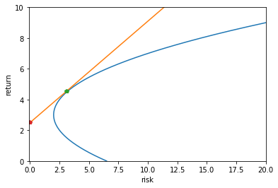

## 量化投资是什么？

### 目录

* 传统投资与量化投资
* 量化投资与有效市场假说
* 再谈量化投资概念
* 一种简单的量化模型：现代资产组合理论（MPT）
* 进一步的量化模型：资本资产定价模型（CAPM）
* 更强大的量化模型：单因子模型和多因子模型（Factor Model）
* 再讲一个量化模型：套利与套利定价模型(APT）

### 传统投资与量化投资

其实感觉标题这么起也不是很恰当，因为传统投资指的是什么方法也没有一个很明确的定义，投资的方法一直都在发展，姑且认为“传统”的就是非量化的其他投资方法吧。从名称上来说，量化投资中的“量化”指的就是数量化，就是需要定量的数据。个人总结，**量化交易=数据+模型**，它包括**量化择时和选股**、**套利**、**资产组合与风险管理**和**算法交易**等。

传统投资主要基于个人的逻辑分析和判断。举个栗子来说，如果有一天你看了苹果的iPhone X发布会，觉得这个产品很牛，肯定大卖。产品大卖肯定会给公司带来可观的利润，紧接着你就去买了苹果公司的股票（NASDAQ: AAPL），等着产品大卖之后股票涨价，卖出股票赚得差价。再或者你觉得楼下彭阿姨买的煎饼果子味道独特，一直有很多回头客来购买，在未来的一两年内煎饼果子摊能扩大生产规模和盈利能力，于是你就去买了彭阿姨煎饼果子摊的股票（NASDAQ: JBGZ，误），以期获取收益。这样的投资方法主要靠投资者个人的推理和判断，并不经过太多的数值计算，我们称之为传统投资方法。大家都很熟悉的巴菲特（Warren Edward Buffett）就更多地采取这样的方法，其投资决定的形成当然也会基于一定的数据和调研，但是最后的决定主要还是由其个人的主观判断形成。当然，比较厉害的就在于其个人判断十分准确，因此取得了很好的投资业绩。不过并不是人人都有巴菲特的这样一个大脑，因此，这种方法可能会非常成功，但是不可复制。

而量化投资主要是基于数据和模型。举例来说，你观察了彭阿姨煎饼果子摊，通过煎饼果子摊资产定价模型，结合你调查到的该公司营业数据，算得该公司价值10w，该公司发行了1w股股票，平均每股价值10元/股，但是目前该公司股价只有5元/股，因此你觉得该公司股票有很大的上涨空间，因此去投资了该公司股票。指出一下，量化投资并不都像这样通过估计股票价值这样来预测股票未来的走势，也有其他的方式。在此领域成功的代表就是西蒙斯（James Harris Simons），如果按盈利能力来算，西蒙斯所管理的大奖章基金的年化收益率可能是巴菲特的两到三倍，并且在数次金融危机中都屹立不倒。其本人就是一名颇有建树的数学家，在转行做金融之后，也是建立了复杂的数学模型来进行量化投资。在赚了很多钱之后，还养了一帮数学家、物理学家做研究，毕竟物理学家好像也不是很贵（自嘲）。我们学校就有西蒙斯本人捐的一栋楼——陈-赛蒙斯楼，现在被用作外国专家楼。

图：陈-赛蒙斯楼（出处见水印）

借用看来的一个比喻，说传统投资方法就像是中医，讲求的是望、闻、问、切，通过医生自己的经验和判断来给患者开方治疗；量化投资就像是西医，需要通过化验、拍片来确定患者的病灶，然后根据一套生理学的理论来给出治疗的方法。西医需要做的抽血化验、拍片检查就好像量化投资里面的数据，数据越准确，越可能得到更好的结论；西医中的生理学理论就好像量化投资中搭建的模型，根据化验检查的结果进行分析得到结论。所以我们常常看到，有很多老中医医术高超，但这种医术并不是刻意轻易学得来的，需要通过一带一的学徒制来传授。而西医讲究的是系统性的方法，可以通过在医学院的学习把这样的方法复制。

总结一下，传统投资方法就好比中医，通过较为主观的分析和判断来进行投资，可复制性较差；量化投资方法好比西医，关键在于数据和模型，通过数值计算来得到投资决策，具有较强可复制性。

### 量化投资与有效市场假说

根据投资的目的来分类的话，仅仅希望能够跟随市场平均水平的投资方式叫做**被动投资**，如果希望投资组合的收益能够超过市场表现，那么这种投资方式叫做**主动投资**。对于做主动投资的人来说，有效市场假说就好像洪水猛兽，因为它直接认定没有办法通过历史数据来获得超额收益。**有效市场假说**（efficient-market hypothesis）是由Eugene Fama于1970年提出的。他另外一个很有名的工作是Fama-French三因子模型，据说他拿这个模型赚了十多年钱，赚完了才把它公布出来，结果又得了个诺贝尔经济学奖。好了，我们回来讲一下这个有效市场假说。这个假说通过一些假设，推出了市场的定价一直处于一个有效的状态下，即市场上的定价已经综合反映了各方面的信息。既然市场定价已经综合反映了市面上的各种信息，那么我们再根据这些信息和历史规律来试图找到一个更为有效的定价就是徒劳的。有效市场假说直接否定了主动投资的可行性。

有效市场假说的想法是说假设股票有效价格的改变是由各种消息驱动的，好消息和坏消息的的到来是随机的。市场的参与者都是独立、理性并且追求利润的，因此当消息传播到市场上之后，这些参与者的投机行为就能够使得价格迅速恢复到新消息下的有效价位上。因此，在这个调节机制下，价格会保持合理，市场会持续有效。根据市场有效的程度，该假说还可以分为论断强弱不同的若干版本。在市场是弱式效率（weak form efficiency）时，我们无法从历史的价量中找到帮助我们盈利的规律；在半强式效率（semi-strong form efficiency）时，从公开渠道获得的所有信息都是无助于我们找到有用规律的；在强式效率（strong form efficiency）时，假说断定从任何渠道获得的信息都无法帮助我们盈利。

这样的假说听起来还挺令人沮丧的。但是个人认为有效市场假说中本身就肯定了肯定了理性市场参与者对于信息进行加工处理然后反作用于市场的作用，亦即正是由于这一部分人通过加工利用这些信息赚到了钱，才把价格拉回到了有效的位置上。如果我们能比其他市场参与者更加迅速地对于市面上的信息做出反应，就能获取相应的利润。从实证的角度上来说，股票市场确实会常常出现“不有效”的定价。A股市场的不有效现象更为明显，其主要原因还是参与者的成熟度离美股市场还有一定的差距，亦即我国股市的定价偏离的机会仍然较多，这也给量化投资以更多的机会。

回头看一下前面把量化投资比作西医的比喻还挺恰当的。量化投资所做的事情就是要找到市场的病灶，即市场定价不合理之处，然后通过投资并且盈利来纠正这样的不合理定价。

### 再谈量化投资概念

有好多名词大家常常和量化投资一起见到，比如说基本面分析、技术面分析、程序化交易等等，它们和量化交易又怎样的关系呢？

首先来讲讲**基本面分析**（fundamental analysis）和**技术面分析**（technical analysis）。基本面分析主要依靠公司财务数据和宏观经济数据，比较常见的公司财务数据有原始数据有公司的总资产、总负债、每股收益等，比较常见的宏观经济数据有GDP增速、国家外汇和黄金储备、货币供应量等。不过就基本面的定义而说，基本面还包括市面上的新闻、公告和舆情信息。而技术面分析主要依靠股票市场历史上的交易价格和成交量，虽然其原始数据比较单调，但在技术面分析中却发展出了大量的分析手段，从价量数据中衍生出相当多的技术指标。

那么基本面分析和技术面分析和量化投资是什么样的关系呢？很多人认为量化投资主要是做技术面分析，其实确实如此，在量化投资领域所用到的技术面信息更多一些。在所利用的基本面信息中，也是更多的用到数量化的公司财务数据和指数化的宏观经济数据，而新闻、公告、舆情等信息的利用相对来讲不是十分充分。究其原因，相比于传统的量化而言，量化投资所需要的数据更倾向于数量化的数据，甚至是结构化的数据；另外，在传统量化中，由于主要靠人工来进行分析，希望数据量尽可能少而精，但与此相反，在量化投资中，我们更倾向于找寻数据中的规律，因此希望有更多的数据。基本面分析中所用到的新闻、公告、舆情信息不便于进行结构化和数量化，因此在目前的量化投资中用到的不多；基本面分析中所用到的财务数据由于其更新频率通常为季度甚至是年度数据，导致其数据量较少，也给其在量化投资中的应用带来了一定的困难。

总结一下，在量化投资中确实更倾向于利用技术面分析中的一些数据，但量化投资也会使用基本面分析中带给我们的数据；目前基本面分析中的信息利用的较少，是由于其使用上的困难，但个人认为将基本面分析中的信息放进量化投资框架中进行研究肯定是量化投资未来的发展方向之一。

那么量化投资是不是一定是程序化交易呢？

答案是不一定。量化投资讲的是一种投资分析的方法。完全可以通过量化投资得到一个结果，然后手动下单交易，并且目前在业界很多中低频交易策略（按星期或者月频率调仓）中，就是通过量化投资方法生成相应的交易方案之后，通过交易员来手动下单操作的。不过如果做出来的量化投资策略就是一个高频的交易，比如日内的择时，甚至是以秒为时间计量的高频交易，这样的策略如果靠人工操作就无法保证其对于量化策略的执行力，因此这样的策略最后一定是靠程序化交易的。

### 一种最简单的量化模型：现代资产组合理论（MPT）

下面进入这一讲的重点，我们将要介绍一些最简单的量化模型。

现代资产组合理论（modern portfolio theory，MPT），是由Harry Markowitz在1952年提出的，他本人也是在38年之后获得了诺贝尔经济学奖。不过，在讲这个模型之前，我们先来讲一下**风险**。

我们常常说一个理性的投资人是*追求利润*并且*厌恶风险*的，所以理性的投资人一直在做的事情就是最大化利润，并且最小化风险。但是我们怎样来衡量风险呢？我们熟知的余额宝就属于风险比较低的理财产品，而股票市场就属于风险比较高的投资。但这样的认识是我们凭感觉得来的，我们能不能用什么办法具体地来计算相应的风险呢？答案是我们可以使用收益率序列的**方差**来表征风险。（还有其他表征风险的方式，方差是一种最基本的方法，见[风险价值（VaR）是否是有史以来最蠢的衡量指标？](https://www.zhihu.com/question/21774616)）

举个栗子，我们可以查看一下余额宝（天弘基金）和平安银行股票（000001.SZ）近期的每日收益率（这里只是举例子，计算可能不科学，因为余额宝在非交易日也会有收益）

| 日期 | 余额宝（每万份收益） | 平安银行股票（折算每万份收益） |
|:--|:--|:--|
|2018-01-24|1.0592 |-6.8259|
|2018-01-25|1.0451 |-300.5464|
|2018-01-26|1.0454 |-105.6338|
|2018-01-29|1.0531 |-220.6406|
|2018-01-30|1.0601 |-65.5022|
|2018-01-31|1.0758 |293.0403|
|2018-02-01|1.0690 |-14.2349|
|2018-02-02|1.0761 |14.2552|
|2018-02-05|1.0788 |355.8719|

当我们要来评价相应的风险的时候就可以计算出两者实际的“风险”究竟是多少。余额宝收益率序列标准差为$\sigma = 0.0123$，平安银行股票收益率序列标准差为$\sigma = 221.8064$。（风险一般用方差$var$来表示，由于这个例子中其方差差距太大，因此就只写标准差）有了这样的数字我们就可以对于其“风险”进行比较了。

下面来讲一下MPT是什么。MPT中的portfolio中文叫做资产组合，资产组合是什么呢？假设市面上有$n$个可以进行投资的标的，一个资产组合可以表示为一个$n$维的向量$P = (w_1, w_1, \cdots, w_n)$，向量的每一维代表该投资组合投资到相应标的的金额比例，且满足$\sum_{i=1}^n w_i = 1$。

每个标的的收益$r_i$都是一个随机变量。资产组合的收益$r_p$也是一个随机变量，并且可以表示为$r_p = \sum_{i=1}^n w_i r_i$。

刚刚我们说了，每个标的的风险可以写成$var(r_i) = cov(r_i, r_i)$。资产组合的的风险也可以写出来$var(r_p) = \sum_{i=1}^n \sum_{j=1}^n cov(r_i, r_j)$。

MPT这个理论要做的就是**在达到期望收益的情况下，最小化投资风险**。因此，对于一个理性的投资者来说，就是要解如下的一个优化问题

$$
\min var(r_p) = \sum_{i=1}^n \sum_{j=1}^n cov(r_i, r_j) \\
s.t. \mathbb{E}(r_p) = \sum_{i=1}^n w_i \mathbb{E}(r_i) \ge \mu, \sum_{i=1}^n w_i = 1
$$

其中的$\mu$就是预期的收益率。我们可以看出，给定一个预期的收益率$\mu$，我们可以解到一个可以最小化风险的资产组合，并且可以得到该资产组合的风险。相应地，我们可以画出在MPT框架下的收益-风险曲线。这条曲线就是下图中的蓝线，也称作**有效前沿**（efficient frontier）或者马科维兹子弹（Markowitz bullet）。

图中的红点为代表无风险利率，我们可以看到它的风险为0，收益为一个特定的值$r_f$，可以简单地把它理解为银行存款利率。蓝线上绿色的点是这条线上**夏普比率**最高的点，这一点对应的资产组合称作**市场组合**（market portfolio）。夏普比率定义为相比于无风险投资的超额收益相对于所承受风险的比值

$$
Sharpe = \dfrac{\mathbb{E}(r_p) - r_f}{var(r_p)}
$$

可以简单地这样理解，有效前沿上的资产组合是都是相应给定收益下风险最小的资产组合，而市场组合是有效前沿上投资收益-风险比（即投资效率）最高的资产组合。注意到，市场组合中不包括无风险资产。如果资产组合能够包括无风险资产，那么还可以组合出橙线以下区域的收益-风险配置，这条橙色的线我们称之为**资本市场线**（capital market line）。为什么这条线上的点可以通过加入无风险资产构建出来呢？简单来说，比如资本市场线上红点和绿点之间的线段，可以通过购买$\alpha$比例的无风险资产再加上$1-\alpha$比例的市场组合来得到。当$\alpha=1$时，全部购买无风险资产，在红点处；当$\alpha=0$时，就为市场组合，在绿点处。其实$\alpha$还可以为负数，这时候相当于以无风险利率从市场借钱，然后购买更多的市场组合，对应的点就在绿点上方的射线上了。

敲黑板，
* 我们使用**方差**来衡量**风险**
* 通过**资产组合**的配置可以降低风险，中和收益
* **有效前沿**是在诸多有风险资产上配置资产组合能达到的最好情况，**市场组合**是其中投资效率最高的一个资产组合
* **资本市场线**是加入无风险资产资产之后能够配置出来收益-风险特征的边界

### 进一步的量化模型：资本资产定价模型（CAPM）

资本资产定价模型（Capital Asset Pricing Model，CAPM）是由Jack Treynor, William F. Sharpe, John Lintner和Jan Mossin等人在MPT基础上独立提出的，CAPM是可以由MPT推导出来的，但这里不做推导了，我们直接写公式。

CAPM表述的是任何一种风险资产的收益率相对于市场组合收益率之间的关系

$$
\mathbb{E}(r_s) = r_f + \beta_s ( \mathbb{E}(r_M) - r_f ) 
$$

$r_s$表示某种风险资产的收益率，可以理解为某只股票的收益率；$r_f$是无风险资产收益率；$r_M$是市场组合收益率；$\beta_s$表示该风险资产相对于市场的敏感性，它的计算公式为$\beta_s = \dfrac{cov(r_s, r_M)}{var(r_M)}$，它反映的是该风险资产收益随着市场组合收益波动的关联性大小。在牛市期间，如果买入$\beta_s > 1$的股票，可能赚钱比市场平均收益更多的收益；在熊市期间，如果持有$\beta_s < 1$的股票能够避免过多的损失，甚至如果某风险资产的$\beta_s < 0$，则该风险资产能帮助你在熊市期间赚钱（比如股票的空头）。

我们来看一下$\beta_s$的计算公式，其分母部分计算方法为$var(r_M) = \sum_{i=1}^N \sum_{j=1}^N w_i w_j cov(r_i, r_j)$，分子部分的计算方法为$cov(r_s, r_M) = \sum_{i=1}^N w_i cov(r_s, r_i)$。通常来讲，市场组合中的证券数目是相当大的。举例来说，A股市场的股票数目现在有三千多只，如果再加上期货、基金可能会有上万中投资标的。相应的分母部分需要计算$N^2$量级个的协方差，运算量非常大。我们之后介绍的因子模型可以解决这样的问题。

总结一下，资本资产定价模型主要说的就是，在投资者都是风险厌恶的情况下，如果某个投资标的具有更大的风险，投资人会期望该投资标的能够带来更大的收益；反过来，如果某投资标的有更多的收益，那么它会承担更多的风险。收益和风险满足公式所描述的线性关系。

### 更强大的量化模型：单因子模型和多因子模型（Factor Model）

单因子模型的提出基于如下的想法，宏观经济的因素对于不同的风险资产的收益都产生影响，并且该影响会较大程度上影响风险资产的收益，如果能把该影响剥离开，就能够更好地来分析风险资产的收益。即认为风险资产的收益可以分解为

$$ r_{i, t} = \alpha_i + \beta_i F_t + \epsilon_{i, t} $$

其中$r_{i, t}$表示风险资产$i$的在$t$时刻的收益；$F_t$是某宏观经济影响因素，它对于不同的资产在同一个时刻都是相同的；$\beta_i$是该资产对于该宏观经济影响因素的敏感程度；$\epsilon_{i, t}$是噪声/残差，其期望为零。

举个例子来说，某股票A在持有初期的期望收益为5%，在持有期期间，GDP增速8%，GDP是影响该股票的唯一因素，它对于GDP增速的敏感程度为1.1。同时，在持有期间，公司发生了一件利好事件，使股价上升3%。则此时该公司收益为

$$ r_A = \alpha_A + \beta_A F + \epsilon_A = 5\% + 1.1 \times 8\% + 3\% = 16.8\% $$

如果我们还知道GDP增速的波动率$\sigma^2_F = 1\%$，该股票噪声波动率$\sigma^2_\epsilon = 4\%$，则可以算出该股票的风险

$$ \sigma^2_A = \beta_A^2 \times \sigma^2_F + \sigma^2_\epsilon = 1.21 \times 1\% + 4 \% = 5.21 \%$$

注意到，单因子模型仅仅认为所有股票只受到一项宏观经济因素的影响，如果认为所有的股票受到多个互不相关因素的影响，那么自然可以写出多因子模型

$$ r_{i, t} = \alpha_i + \beta_i^{(1)} F_t^{(1)} + \cdots + \beta_i^{(K)} F_t^{(K)} + \epsilon_{i, t} $$

一般称$\beta$为因子暴露，$F$为因子收益。

当多因子模型包含的因子为宏观经济相关的内容时（比如国内生产总值、货币供应量、黄金和外汇储备等），这类宏观经济数据的基本形式就是一列与特定股票$i$无关的时间序列，我们通常把它们作为因子收益；然后在每一只股票上做**时间序列回归**得到相应的因子暴露。这时，因子收益代表的是宏观经济带来的全局性（也称系统性）的收益率，因子暴露代表的是该股票对于这一项宏观经济指标波动的敏感性。

那时间序列回归怎么做？

把股票$i$固定的时候，去拟合如下方程

$$ r_{t} = \alpha + \beta^{(1)} F_t^{(1)} + \cdots + \beta^{(K)} F_t^{(K)} $$

这时，该股票的收益率时间序列$r_t$和诸多宏观经济时间序列$F_t^{(k)}$都已知，通过多元线性回归就可以求到相应的$\alpha$和$\beta^{(k)}$

通常多因子模型所包含的因子还可以为与特定股票相关的基本面或者技术面特征（比如该股票的近期趋势、市值大小、相对估值等），这类数据的基本形式是对于每一只股票，都有一个时间序列。比如常见的反映股票规模的因子``股票总市值``，具体来说就等于该股票的股价乘上该公司发行的总股数。这个因子每天对于每只股票都会有一个数值。这时，相应的多因子模型就写作

$$
r_{i,t} = \beta_t + X_{i, t}^{(1)} f_t^{(1)} + \cdots + X_{i, t}^{(K)} f_t^{(K)} + \epsilon_{i, t}
$$

这时因子暴露$X_{i, t}^{(k)}$代表的就是该股票这个时刻在某种风险上的暴露。举例来说，我们都知道一家小的公司比一家大公司有更大的倒闭风险（即市值风险），因此，如果``股票总市值``这个因子数值越小，就说明该公司更多地暴露在市值风险上，即更容易因为战乱、政府政策等外部原因倒闭或者亏损。既然小市值的公司承受了更大的风险，那么根据风险溢价的原理来说，小市值公司的收益率期望就会更高。那么减小每单位的市值，市场上的投资者希望收回多少额外的收益呢？这件事情就由相应的因子收益来衡量了。因子收益如何得到呢？我们一般通过**横截面回归**来得到相应的因子收益。

那么横截面回归怎么做？

把同一个时刻或者一段时期中的不同数据点拿过来，拟合如下方程，就是横截面回归。这个时候，时间参数$t$就是固定的了。

$$
r_{i} = \beta + X_{i}^{(1)} f^{(1)} + \cdots + X_{i}^{(K)} f^{(K)}
$$

其中不同股票的收益率$r_i$和每只股票在此时的因子暴露数值$X_{i}^{(k)}$是已知的，通过多元线性回归得到相应的$\alpha$和$f^{(k)}$

补充两点说明（如果怕被搅晕可以不用看），

1. 我没有统一这两种模型的记号，原因是写了之后懒得改了（误），这样的记号比较约定俗成（误），其实书籍论文、券商研报的记号也是鱼龙混杂，大家抓住实质就好。
2. 对于第二种模型来说，虽然我纠结再三还是在$\beta$和$f$下加上了脚标$t$，但是我们假定它们在一段较长的时期内是不变化的。即它们随时间变化的速度比因子暴露$X$随时间的变化慢很多。

最后再补充一点（如果还没有被搅晕那就继续往下看吧）

***多因子模型该如何应用？***

先说一句，大家通常用$\alpha$表征特质性收益，用$\beta$表示系统性收益。而大家常常说，Alpha是量化投资的圣杯，大家做的就是去找Alpha。就我们这个模型而言怎样找Alpha呢？

对于第一种模型来说，如果要选股，可以选择单股特质收益$\alpha_i$比较高的股票，这表明该股票在剥离掉宏观经济影响因素之后，仍然有较高的收益率；如果要做资产组合，那么可以找一个资产组合是的该资产组合中的$\alpha$按比例加起来大于零，并且对于每一项$\beta$按比例加起来都等于零，其含义就是该资产组合不受到所有外部宏观经济的影响，纯靠自己的特质赚钱。简言之，就是抵消Beta，找到Alpha。

对于第二种模型来说，外部系统的风险都集中反映到截距项$\beta_t$中（这也是为什么我们在这里用$\beta$），而股票特质性的收益被分解到了后面的$X_{i, t}^{(1)} f_t^{(1)} + \cdots + X_{i, t}^{(K)} f_t^{(K)}$中。因此，我们要做的就是找到后面这一坨算出来的数值最大股票。这些因子就叫做**Alpha因子**，对应的这一坨就称为**Alpha收益**。

当然，随着市场上根据这个模型来操作的玩家越来越多，一旦一种因子暴露$X^{(k)}$的计算方法被大家都知道了，大家就会通过相应的投资作用于市场，这个时候，相应的因子收益$f^{(k)}$就会被市场上使用这个因子的玩家一点点吃掉。当该因子被完全吃掉的时候，该因子的因子收益会接近于零，这个时候，该因子就失效了。当该因子失效之后，该因子就不能再作为Alpha因子了。再多说一句，对于一个失效的因子来说，在较长的时间段内做横截面回归，相应的因子收益$f$接近于零；如果在跨度较短的每个横截面都做回归，得到一系列的因子收益$f_t$，它的均值接近于零。对失效的因子来说，其因子收益$f_t$均值接近于零，但是它在每个小的横截面上的的数值绝对值都很大，那么我们可以把它们作为**风险因子**保留在模型中。风险因子对应的收益我们称之为**Beta收益**。

如果我们的因子都被吃掉了那该怎么办？我们需要从残差项中发掘出新的因子，如果新的因子加入之后，总体的残差变小，说明新的因子对于股价具有解释能力。如果这个因子对应的因子收益$f_t$能够很稳定地朝同一个方向偏离零，那么这个因子就能够作为一个Alpha因子了，其对应的收益就为Alpha收益。对于选股而言，我们就可以选出Alpha收益更大的股票。对于构建资产组合来说，我们可以找一个资产组合是的其Alpha收益按资产组合的比例加起来最大，并且其Beta收益按比例加起来为零。

刚刚讲的这两种模型对应的构建资产组合的方法都是最大化Alpha收益，并且尽量抵消掉Beta收益，这样的做法就叫做**Alpha策略**。

为什么大家希望抵消Beta收益呢？因为这里大家假设宏观经济更难以预测，而对于单个股票或者对于单个因子的预测更有信心。当然，如果你对于宏观经济十分了解，能够很好地预测宏观经济的走向，那么你就去赌beta，一样可以赚钱。比如，你预测未来宏观经济走势较强、社会局势稳定、工业发展迅速，那么小市值因子（现在认为它是一种风险因子，并且注意我说的是“小”市值因子）对应的因子收益就会大于零，那么你就去买小市值股票，赚钱Beta收益。

***多因子模型相比于CAPM的优势在哪里？***

假设市场上投资标的个数为$N$，研究的时间截面个数为$T$，因子个数为$K$。刚刚说到CAPM要计算某只股票的期望收益就需要计算该支股票的$\beta_s$，大概需要计算$N^2$个协方差，每个协方差的计算为两列长度为$T$的序列。在多因子模型中，如果需要计算计算某只股票的期望收益只需要做$K$维线性回归。对于时间序列回归来说，输入为$K+1$个长度为$T$的序列；对于横截面回归来说，输入为$K+1$个长度为$N$的序列。通常$K$比$N$要小很多，因此多因子模型相比于CAPM，计算量减小了很多。

总结一下，多因子模型分为两类。一种是使用宏观经济因素来作为因子的模型，这种模型可以直接得到因子收益，通过时间序列回归得到因子暴露；另一种是使用表征股票特征的基本面或者技术面因素来作为因子的模型，这种模型可以直接得到因子暴露，通过横截面回归得到因子收益。

第一种：
$$ r_{i, t} = \alpha_i + \beta_i^{(1)} F_t^{(1)} + \cdots + \beta_i^{(K)} F_t^{(K)} + \epsilon_{i, t} $$

第二种：
$$ r_{i,t} = \beta_t + X_{i, t}^{(1)} f_t^{(1)} + \cdots + X_{i, t}^{(K)} f_t^{(K)} + \epsilon_{i, t} $$

### 再讲一个量化模型：套利与套利定价模型

**套利**（arbitrage）是利用同一种或者相似的实物资产或金融资产的不同价格来获取无风险受益的行为，是通过买入收益率偏高的证券同时卖出收益率偏低的证券来实现的。勾一下重点就是*同时买入和卖出*。比如说，你看到学校食堂里面的鸡蛋七毛钱一个，同样的鸡蛋在学校大门外要买一块钱，那你就从食堂买来鸡蛋立马跑到校门外去卖掉，这个就是套利。假如你要是买来一堆鸡蛋，先屯着不卖，等过年鸡蛋涨价的时候再卖，这种赚钱的方式就不属于套利。

**套利定价模型**（arbitrage pricing theory，APT）讲的是一个理想的市场条件下各个证券定价应该满足的表达式。这里所说的*理想市场条件*指的是市场没有交易成本，同时市场中的交易者都是回避风险并且对于证券的预期报酬有一致性看法。那么证券定价就满足以下表达式

$$
r_i = \alpha_i + \beta^{(1)}_i F^{(1)} + \cdots + \beta^{(K)}_i F^{(K)} + \epsilon_i
$$

这里的表达形式和参量代表的含义其实质与我们之前讲的多因子模型是一样的，只是由于这里不考虑时间序列的特性，因此省略了时间下标。不过需要注意的是，对于每只股票的$\beta$而言，还是需要像多因子模型一样，通过时间序列回归来得到。

如果一个资产组合满足以下三点要求，我们就称之为**套利组合**（arbitrage portfolio）
* 初始投资为零，即对投资组合$P=(w_1, \cdots, w_N)$有$\sum_{i=1}^N w_i = 0$
* 投资组合的风险为零，风险分为系统性风险和非系统性风险。系统性风险为零即对于任意的$k \in [K]$，$\sum_{i=1}^N \beta_i^{(k)} w_i = 0$；非系统风险则要求投资的种类足够多和分散，由大数定理就能够得到$\sum_{i=1}^N w_i \epsilon_i = 0$
* 当然最重要的一点就是盈利为正，即$\sum_{i=1}^N w_i r_i = 0$，结合前两条，有$\sum_{i=1}^N w_i \alpha_i = 0$

当市场上存在这一的套利组合的时候，我们就说这个市场上存在**套利机会**。

举一个例子，假如市场上有三只股票，分别是A、B、C，我们暂时只考虑一个宏观经济的影响因素，这三只股票的收益率和它们对该因素的敏感程度如下表所示

| 股票 | 收益率 | 敏感程度 |
|:----|:-------|:--------|
| A   | 12%    | 1.0     |
| B   | 25%    | 3.5     |
| C   | 15%    | 2.0     |

那么这样的一个市场是否存在套利机会呢？我们可以看到，通过构建一个套利组合$P=(0.3, 0.2, -0.5)$，可以实现投资总额$\sum_{i=1}^N w_i = 0.3 + 0.2 + (-0.5) = 0$，同时，系统性风险$\sum_{i=1}^N w_i \beta_i = 0.3 * 1 + 0.2 * 3.5 - 0.5 * 2.0 = 0$。但是总的收益$\sum_{i=1}^N w_i r_i = 12\% \times 0.3 + 25\% \times 0.2 + 15\% \times (-0.5) = 1.1\% > 0$。

因此，这样的市场存在套利机会，通过构建这样的组合，我们可以在没有系统性风险的情况下获得$1.1\%$的期望收益。

不过需要提一下的是，套利定价模型只是给我们提供了一个这样的框架，这样的套利组合是否真正地能够盈利其实更多地取决于你把什么东西当做因子填到公式中，如果你选定的一组因子对于交易者对于证券的预期有很好的解释能力，那么你找到的套利机会才是“真”套利机会。

